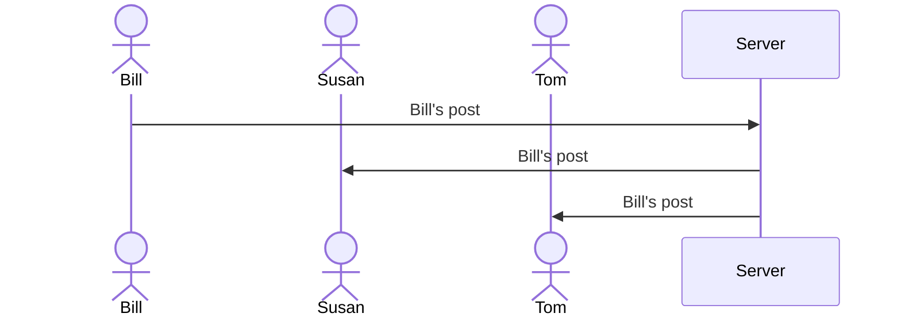

# Shoot for the Stars

[My Notes](notes.md)

A goal-based self motivation website

> [!NOTE]
>  This is a template for your startup application. You must modify this `README.md` file for each phase of your development. You only need to fill in the section for each deliverable when that deliverable is submitted in Canvas. Without completing the section for a deliverable, the TA will not know what to look for when grading your submission. Feel free to add additional information to each deliverable description, but make sure you at least have the list of rubric items and a description of what you did for each item.

> [!NOTE]
>  If you are not familiar with Markdown then you should review the [documentation](https://docs.github.com/en/get-started/writing-on-github/getting-started-with-writing-and-formatting-on-github/basic-writing-and-formatting-syntax) before continuing.

## 🚀 Specification Deliverable

> [!NOTE]
>  Fill in this sections as the submission artifact for this deliverable. You can refer to this [example](https://github.com/webprogramming260/startup-example/blob/main/README.md) for inspiration.

For this deliverable I did the following. I checked the box `[x]` and added a description for things I completed.

- [x] Proper use of Markdown
- [x] A concise and compelling elevator pitch
- [x] Description of key features
- [x] Description of how you will use each technology
- [x] One or more rough sketches of your application. Images must be embedded in this file using Markdown image references.

### Elevator pitch

Many of us have a lot of different things that we want to get done, but lack the self-motivation to complete it. Shoot for the Stars is a solution to that! Just pick a thing you want, and Shoot for the Stars will help you use it as a motivator to achieve your goals and start good habits. With a simple and intuitve design, it'll keep you coming back until you achieve everything you'd hoped, if not more!

### Design

As can be seen in these images, there will be 3 main pages. A simple login page, a home page, and a community page. Each can be accessed by a bar on the top of the screen. Attempting to use the home page without logging in will redirect the user to the login page. On the home page, the individual elements will be dynamically rendered, as the user enters them, as react elements. There will also be a star counter that automatically updates as the user completes goals. The community page will use the same goal/reward elements as the home page, just changed slightly to show that it has been achieved and a space to write a note.  
This diagram represents how the server recieves and resends community posts.

### Key features

- __Treat yourself!__ Pick a reward, write a discription of it, add a photo -- Whatever helps you remember why your're achieving your goals.
- __Set goals!__ Set goals to earn stars, with customization for repeating or long-term goals.
- __Share with friends!__ Proud of your achivements? Post them to the community on the community board!

### Technologies

I am going to use the required technologies in the following ways.

- **HTML** - Uses correct HTML structures to create a login, home, and community page
- **CSS** - Simplistic, appealing application design that adapts to a variety of screen sizes
- **React** - Dynamically rendered goal, reward, and community elements, as well as login system
- **Service** - Backend service components including:
    - Placeholder images for users that don't want to upload their own
    - Secure password management
    - Use an IP address locator to display nearby community posts
    - Other necessary site functions :grin:
- **DB/Login** - Securly store:
    - User login information
    - The goals, rewards, and star values of each account
    - Community posts for a certain amount of time
- **WebSocket** - Live updates to the community board

## 🚀 AWS deliverable

For this deliverable I did the following. I checked the box `[x]` and added a description for things I completed.

- [x] **Server deployed and accessible with custom domain name** - [My server link](https://startup.shootforthestars.click/).

## 🚀 HTML deliverable

For this deliverable I did the following. I checked the box `[x]` and added a description for things I completed.

- [x] **HTML pages** - 4 HTML pages integrated - login (index), about, community, and main (accessed through clicking the star or login button)
- [x] **Proper HTML element usage** - Header, footer, and main present on all pages. Features a number of tables and imput options as well.
- [x] **Links** - Links connect all pages together correctly.
- [x] **Text** - There is text on the about page, as well as placeholder text representing future features, like community posts
- [x] **3rd party API placeholder** - Will use 3rd party ip address locator to find community posts from people nearby
- [x] **Images** - Placeholder images have been uploaded for the logo as well as possible options for rewards
- [x] **Login placeholder** - Placeholder to imput username and password, as well as a placeholder to welcome the user after signin.
- [x] **DB data placeholder** - Placeholders for star count and goals, as well as login information, all of which will be stored in the DB
- [x] **WebSocket placeholder** - Placeholder for community posts, which will serve as real time websocket communication

## 🚀 CSS deliverable

For this deliverable I did the following. I checked the box `[x]` and added a description for things I completed.

- [x] **Header, footer, and main content body** - Header, footer, and body have distinctive colors, in a flex box to maintain their positioning
- [x] **Navigation elements** - Navigation elements are aligned and change colors when hovered over
- [x] **Responsive to window resizing** - Flex/grid elements resize automatically, and the header reduces the amount of content on smaller screen sizes
- [x] **Application elements** - Each element contains common colors and styles across the different pages
- [x] **Application text content** - Imported a font to use, as well as a variety of text colors and sizes
- [x] **Application images** - Images were styled with simply borders and border radiuses to match with the page

## 🚀 React part 1: Routing deliverable

For this deliverable I did the following. I checked the box `[x]` and added a description for things I completed.

- [x] **Bundled using Vite** - Bundled and deployed using Vite
- [x] **Components** - All HTML has been converted to jsx, and all table elements have been changed to react components
- [x] **Router** - Routing between login, home, community, and about, as well as a page not found feature

## 🚀 React part 2: Reactivity

For this deliverable I did the following. I checked the box `[x]` and added a description for things I completed.

- [x] **All functionality implemented or mocked out** - Login, reward and goal creation and completion, and posting and recieving community posts have all been mocked out.
- [x] **Hooks** - React states and effects have been used to implement all functionality - login, goal, reward, community post, and image src

## 🚀 Service deliverable

For this deliverable I did the following. I checked the box `[x]` and added a description for things I completed.

- [x] **Node.js/Express HTTP service** - Both node and express installed. Express imported in index.js and listens on port 4000
- [x] **Static middleware for frontend** - Backend statically sends public directory
- [x] **Calls to third party endpoints** - Placeholder cat image for invalid reward urls. Plans to add more services in the future.
- [x] **Backend service endpoints** - Backend endpoints for authentication and storing/getting user data
- [x] **Frontend calls service endpoints** - Frontend code sends user request and displays information from server.
- [x] **Supports registration, login, logout, and restricted endpoint** - Fully support authentication and restricts access to play page.

## 🚀 DB/Login deliverable

For this deliverable I did the following. I checked the box `[x]` and added a description for things I completed.

- [x] **Stores data in MongoDB** - Stores users goal, reward, star count, and recent events in mongoDB
- [x] **Stores credentials in MongoDB** - Stores login information in MongoDB

## 🚀 WebSocket deliverable

For this deliverable I did the following. I checked the box `[x]` and added a description for things I completed.

- [ ] **Backend listens for WebSocket connection** - I did not complete this part of the deliverable.
- [ ] **Frontend makes WebSocket connection** - I did not complete this part of the deliverable.
- [ ] **Data sent over WebSocket connection** - I did not complete this part of the deliverable.
- [ ] **WebSocket data displayed** - I did not complete this part of the deliverable.
- [ ] **Application is fully functional** - I did not complete this part of the deliverable.
